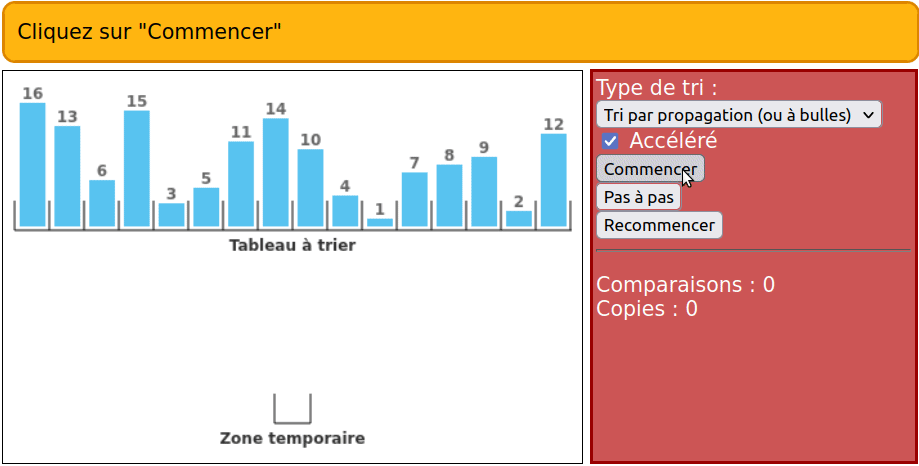

# Exercices de NSI complétés
## Méthodes sur les chaines de caractères

### Principales méthodes sur les chaines de caractères
<details>
   <summary>Renvoyer une chaine en majuscules</summary>

  ```python
  chaine.upper()
  ```
</details>

<details>
   <summary>Renvoyer une chaine en minuscules</summary>

  ```python
  chaine.lower()
  ```
</details>

<details>
   <summary>Renvoyer une chaine avec une majuscule au début</summary>

  ```python
  chaine.capitalize()
  ```
</details>

<details>
   <summary>Tester si une chaine est dans une autre chaine</summary>

  ```python
  "chaine" in autre_chaine
  ```
</details>

<details>
   <summary>Trouver l'index d'une chaine dans une autre chaine</summary>

  ```python
  autre_chaine.find("chaine")
  ```
  <sub>note : si la chaine n'est pas trouvée cela renvoie -1, la méthode ne renvoie l'index de la première occurence</sub>
</details>

<details>
   <summary>Compter le nombre d'occurences d'une chaine dans une autre chaine</summary>

  ```python
  autre_chaine.count("chaine")
  ```
</details>

<details>
   <summary>Caractère spécial pour le saut de ligne</summary>

  ```python
  "\n"
  ```
</details>

<details>
   <summary>Caractère spécial pour la tabulation</summary>

  ```python
  "\t"
  ```
</details>

<details>
   <summary>Formater une chaine de caractère (inculre une variable dedans)</summary>

  ```python
  chaine = f"voici le contenu de ma_var : {ma_var}"
  ```
</details>

<details>
   <summary>Renvoyer une liste à partir d'une chaine de caractère</summary>

  ```python
  liste = chaine.split()
  ```
  note: on peut spécifier un séparateur comme suit
  ```python
  liste = chaine.split("séparateur")
  ```
</details>

<details>
   <summary>Renvoyer une liste transformée en chaine de caractère</summary>

  ```python
  chaine = "séparateur".join(liste)
  ```
</details>

### Exercices
[Exercice 1](Méthodes%20sur%20les%20chaines%20de%20caractère/Ex1.py)  
[Exercice 2](Méthodes%20sur%20les%20chaines%20de%20caractère/Ex2.py)  
[Exercice 3](Méthodes%20sur%20les%20chaines%20de%20caractère/Ex3.py)  
[Exercice 4](Méthodes%20sur%20les%20chaines%20de%20caractère/Ex4.py)  
[Exercice 5](Méthodes%20sur%20les%20chaines%20de%20caractère/Ex5.py)  
[Exercice 6](Méthodes%20sur%20les%20chaines%20de%20caractère/Ex6.py)  
[Exercice 7](Méthodes%20sur%20les%20chaines%20de%20caractère/Ex7.py)  
[Exercice 8](Méthodes%20sur%20les%20chaines%20de%20caractère/Ex8.py)  
[Exercice 9](Méthodes%20sur%20les%20chaines%20de%20caractère/Ex9.py)  

## Méthodes sur les listes

### Principales méthodes sur les listes
<details>
   <summary>Ajouter un élément à la fin</summary>

  ```python
  liste.append(elt)
  ```
</details>


<details>
  <summary>Insérer un élément</summary>

  ```python
  liste.insert(index, elt)
  ```

</details>

<details>
  <summary>Supprimer un élément avec l'index</summary>

  ```python
  del liste[index]
  ```

</details>

<details>
  <summary>Supprimer la première occurence de l'élément </summary>

  ```python
  liste.remove(elt)
   ```

</details>

<details>
  <summary>Trier la liste</summary>

  ```python
  liste.sort()
   ```

  <details>
    <summary>Inverser le tri</summary>

    ```python
    liste.sort(reverse=True)
    ```
  </details>

</details>

<details>
  <summary>Création d'une liste triée à partir d'une liste</summary>

  ```python
  sorted(liste)
  ```

  <details>
    <summary>Inverser le tri</summary>

    ```python
    sorted(liste, reverse=True)
    ```
  </details>

</details>

<details>
  <summary>Inverser la liste</summary>

  ```python
  liste.reverse()
   ```

</details>

<details>
  <summary>Compter le nombre d'occurences d'un élément</summary>

  ```python
  liste.count(elt)
   ```

</details>

<details>
  <summary>Supprimer/Récupérer le dernier élément de la liste</summary>

  ```python
  liste.pop()  
   ```
  note : cette méthode renvoie l'élément cela veut dire que pour

  ```python
  a = liste.pop()  
   ```
  *a* contiendra le dernier élément de la liste

</details>

### Exercices
[Exercice 1](Méthodes%20sur%20les%listes/Ex1.py)  
[Exercice 2](Méthodes%20sur%20les%listes/Ex2.py)  
[Exercice 3](Méthodes%20sur%20les%listes/Ex3.py)  
[Exercice 4](Méthodes%20sur%20les%listes/Ex4.py)  
[Exercice 5](Méthodes%20sur%20les%listes/Ex5.py)  
[Exercice 6](Méthodes%20sur%20les%listes/Ex6.py)  
[Exercice 7](Méthodes%20sur%20les%listes/Ex7.py)  
[Exercice 8](Méthodes%20sur%20les%listes/Ex8.py)  
[Exercice 9](Méthodes%20sur%20les%listes/Ex9.py)  

## Algorithmes de tri
### Tri par sélection 
Le principe du tri par sélection/échange (ou tri par extraction) est d'aller chercher le plus grand élément de la liste de taille  𝑛
pour le mettre en dernier, puis de recommencer en allant chercher le plus grand élément de la liste de taille  𝑛−1
pour le mettre en avant dernier dans la liste de taille  𝑛, etc...


### Tri par insertion
C'est le tri du joueur de cartes. On fait comme si les éléments à trier étaient donnés un par un, le premier élément constituant, à lui tout seul, une liste triée de longueur 1. On range ensuite le second élément pour constituer une liste triée de longueur 2, puis on range le troisième élément pour avoir une liste triée de longueur 3 et ainsi de suite...

Le principe du tri par insertion est donc d'insérer à la nième itération le nième élément à la bonne place.


### Tri bulle

Le principe du tri à bulles (bubble sort ou sinking sort en anglais) est très simple : pour trier une liste, on compare son premier et son second élément et on les échange si nécessaire. Puis on fait la même chose pour le second et le troisième, puis pour le troisième et le quatrième… jusqu’à ce qu’on arrive à la fin de la liste. 

On remarque, qu’après le premier passage, l’élément le plus grand se retrouve à sa place définitive. Au deuxième passage, il sera donc inutile de le comparer avec le précédent. A chaque itération, on aura un élément de plus qui sera correctement placé à la fin de la liste. On pourra donc, à chaque fois, s’arrêter un peu plus tôt.


